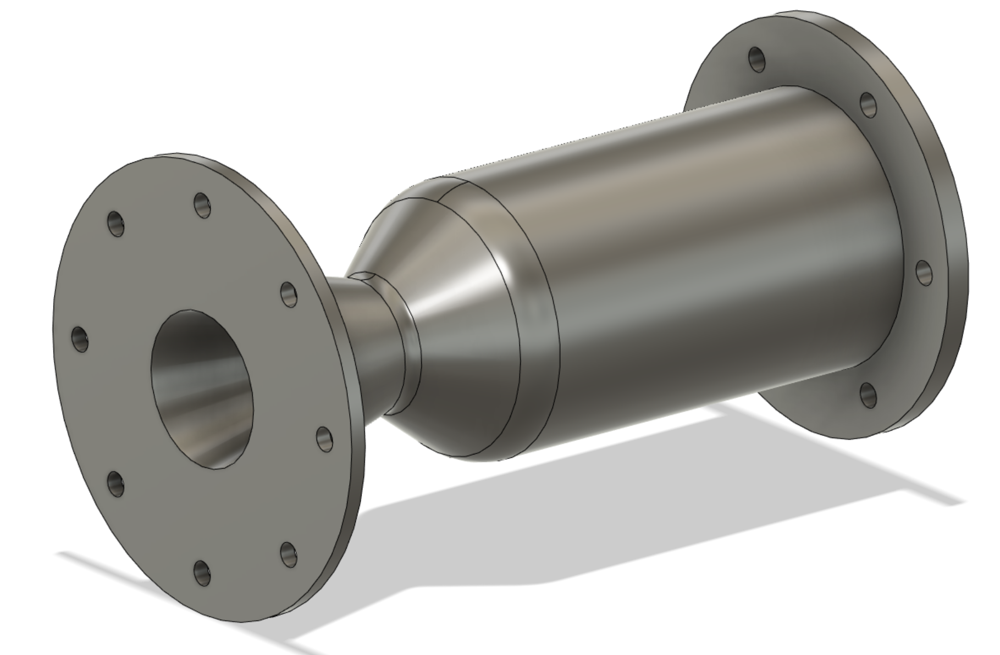
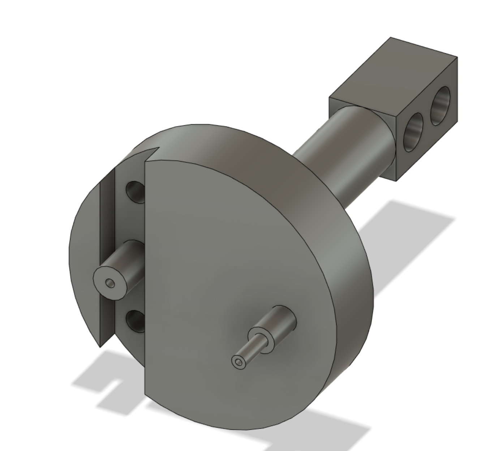
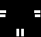
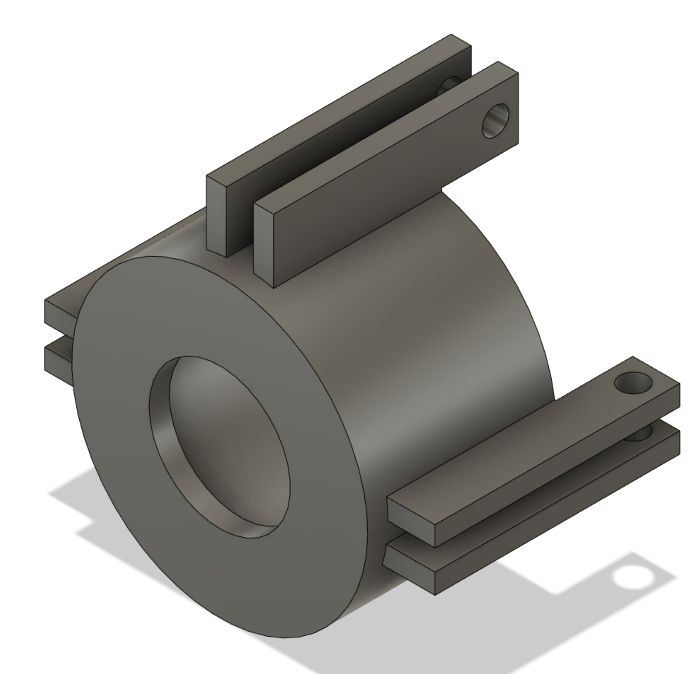

# CUDA-accelerated-Voxelization

**Voxelization method that converts a triangle mesh into a 3d grid of voxels.**

  
  
  
   
    <em>A converging-diverging nozzle I designed to burn kerosene and high-test peroxide </em>
 

For large meshes with many triangles (the rocket nozzle above has over 6000), calculating intersections becomes extremely computationaly expensive. CUDA acceleration is used to accelerate this process, as voxelization is mathematically very similar to the graphics calculations that GPUs are designed for. When an stl file is voxelized, we consider individual lines across the 3d grid at a time. *This is actually unoptimal, since most GPUs have enough power to consider entire layers at a time, however I designed this with large STL files in mind, on the order of meters in a dimension. And, I wrote the majority of this when I had very little CS experience, so sue me.* The triangles that are known to intersect that line are then found, and then each point along that line is tested to see if it intersects with any of these triangles. With this, we produce a 3D grid of booleans where every voxel that intersects at least one triangle is filled. 

  
  
   
    <em>The press head for a rotary press intended to form primer cups out of brass sheet.</em>

  
I do a lot of CAD work with fusion360, and I wanted to do a project that would allow for cool visualizations and simulations with models I make, as well as an excuse to dip my feet into CUDA programming. My only parallelization experience before this was with POSIX threads in C, and that was minimal at best. The original motivation was to create a voxelization tool that would allow for interesting simulations, particularly of neutron interactions with certain metals, to be run much more easily. Voxels are actually quite useful for this purpose as they are a particularly easy base unit to deal with. I had no idea what I was getting into, and the precursor project became a main project.

  
  
   
    <em>The mount for holding the rotary encoder of my pendulum balancing project.</em>

